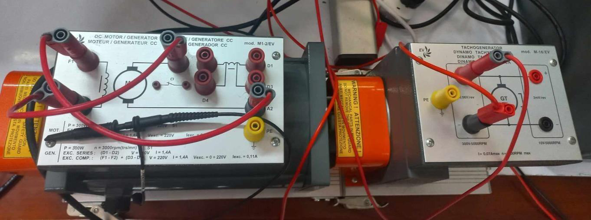
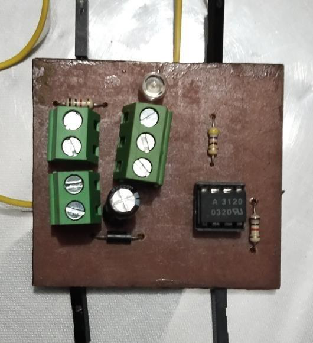
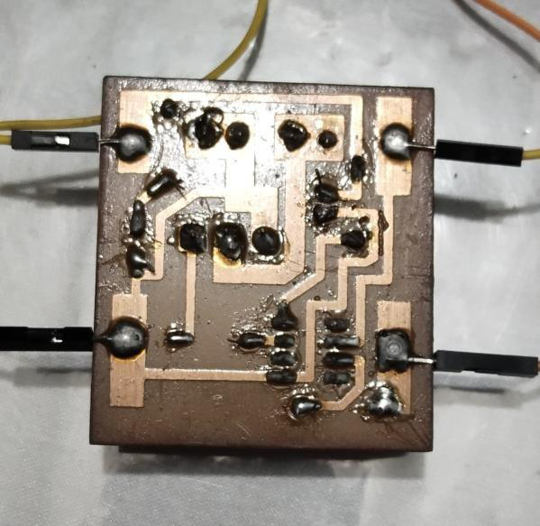
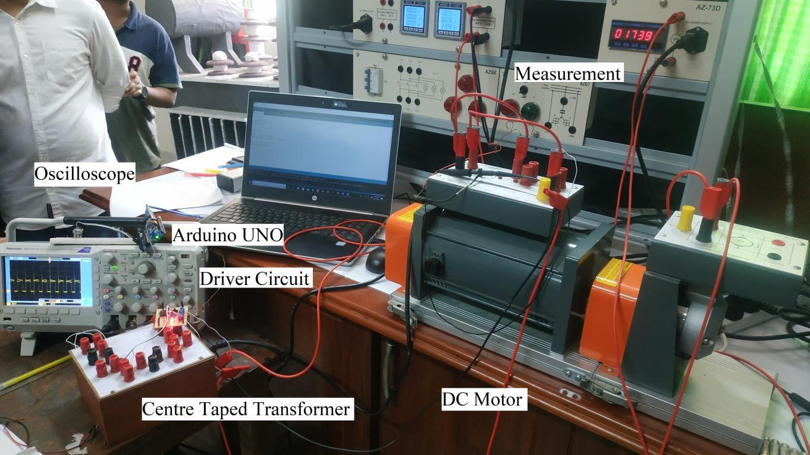
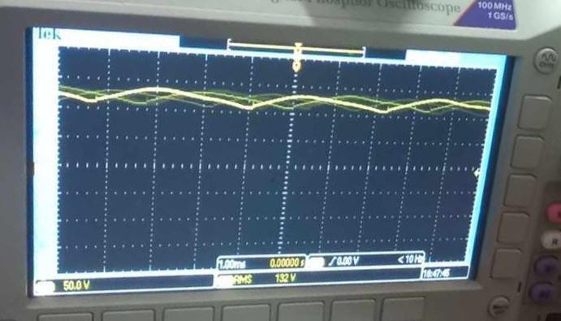
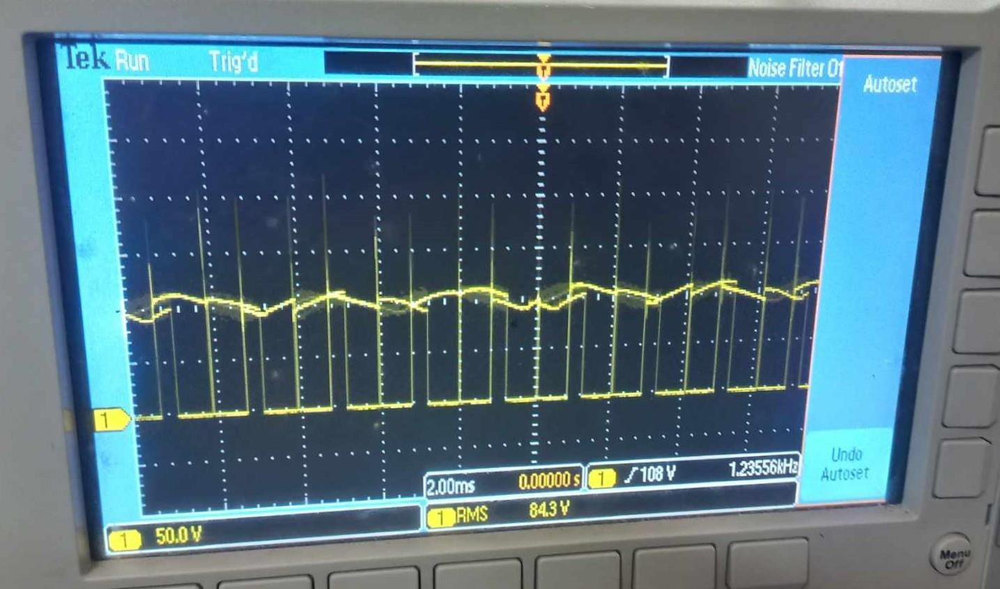

# **DC Motor Speed Control using Temperature Sensor**

An Arduino-based embedded system project for controlling DC motor speed using PWM, a potentiometer as a temperature sensor analogy, and a driver circuit.

## **Project Overview**

This project demonstrates DC motor speed control using an Arduino Uno, PWM signal generation, and a driver circuit. The experiment uses a potentiometer as an analogy for a temperature sensor. By changing the potentiometer resistance, the duty cycle of the PWM signal changes, which controls the average input voltage applied to the DC motor.

The main purpose of this experiment is to understand how PWM can be used to regulate the speed of a DC motor in an embedded system. The output waveform was observed using an oscilloscope at different duty cycles.

## **Objectives**

* To install and use a controller system to manage a DC motor.
* To use Arduino Uno to generate PWM signals.
* To use a driver circuit and BJT to adjust the duty cycle.
* To control the speed of a DC motor by changing the PWM duty cycle.
* To observe the DC motor input waveform using an oscilloscope.
* To understand the relationship between duty cycle and average input voltage.

## **Theory**

The speed of a DC motor can be controlled using different techniques such as voltage supply control, armature resistance control, field winding control, chopper control, feedback control, and Pulse Width Modulation.

In this experiment, the PWM method is used.

Pulse Width Modulation, or PWM, controls the average voltage supplied to a load by switching the signal on and off rapidly. The percentage of time for which the signal remains ON is called the duty cycle.

A higher duty cycle gives a higher average voltage and increases the motor speed. A lower duty cycle gives a lower average voltage and decreases the motor speed.

```text
Higher duty cycle  → Higher average voltage → Higher motor speed
Lower duty cycle   → Lower average voltage  → Lower motor speed
```

The potentiometer is used as an analogy for a temperature sensor. By changing the potentiometer resistance, the Arduino reads a different analog value and generates a corresponding PWM signal.

## **Required Apparatus**

* DC motor
* Oscilloscope
* Potentiometer
* Driver circuit
* Probe
* Arduino Uno
* Voltmeter
* Ammeter
* Centre-tapped transformer
* Arduino software
* MATLAB Simulink software
* Personal computer
* Power diode

## **DC Motor Connection**

### **Figure 1: Experimental Connection of DC Motor**



**Description:**
This figure shows the experimental DC motor connection used in the laboratory setup.

## **Driver Circuit**

### **Figure 2: Upper Layer View of Driver Circuit**



**Description:**
This figure shows the upper layer of the driver circuit used to control the DC motor input signal.

### **Figure 3: Lower Layer View of Driver Circuit**



**Description:**
This figure shows the lower layer of the driver circuit, including the soldered connections and PCB tracks.

## **Experimental Setup**

### **Figure 4: Experimental Setup of DC Motor Speed Control**



**Description:**
This figure shows the complete experimental setup, including Arduino Uno, driver circuit, oscilloscope, centre-tapped transformer, measurement unit, and DC motor.

## **Oscilloscope Observations**

### **Figure 5: DC Motor Input at 100% Duty Cycle**



**Description:**
This figure shows the DC motor input waveform observed on the oscilloscope at 100% duty cycle.

### **Figure 6: DC Motor Input at 80% Duty Cycle**



**Description:**
This figure shows the DC motor input waveform observed on the oscilloscope at 80% duty cycle. The waveform confirms that the PWM signal changes according to duty cycle variation.

## **Arduino Code**

The Arduino source code is stored in:

```text
src/dc_motor_speed_control_pwm.ino
```

## **Sample Arduino Code**

```cpp
const int sensorPin = A0;
const int motorPin = 9;

int sensorValue = 0;
int pwmValue = 0;

void setup() {
  Serial.begin(9600);
  pinMode(motorPin, OUTPUT);
}

void loop() {
  sensorValue = analogRead(sensorPin);

  pwmValue = map(sensorValue, 0, 1023, 0, 255);

  analogWrite(motorPin, pwmValue);

  Serial.print("Sensor Value: ");
  Serial.print(sensorValue);
  Serial.print(" | PWM Value: ");
  Serial.println(pwmValue);

  delay(500);
}
```

## **How to Run the Project**

1. Open Arduino IDE.
2. Connect the Arduino Uno board to the computer.
3. Open the source file:

```text
src/dc_motor_speed_control_pwm.ino
```

4. Select the board:

```text
Tools > Board > Arduino Uno
```

5. Select the correct port:

```text
Tools > Port
```

6. Upload the code to the Arduino Uno.
7. Connect the potentiometer to the Arduino analog input pin.
8. Connect the PWM output pin to the motor driver circuit.
9. Connect the driver circuit output to the DC motor.
10. Rotate the potentiometer and observe the change in motor speed.
11. Use the oscilloscope to observe the PWM waveform at different duty cycles.

## **Working Principle**

The potentiometer acts as an analog input device. When its resistance changes, the Arduino reads a different analog value.

The Arduino converts the analog value into a PWM value. This PWM signal is sent to the driver circuit, which controls the power delivered to the DC motor.

As the duty cycle increases, the average input voltage of the motor increases, and the motor speed becomes higher. As the duty cycle decreases, the average input voltage decreases, and the motor speed becomes lower.

## **Observation**

The oscilloscope waveform shows the input signal applied to the DC motor.

At 100% duty cycle, the motor receives the maximum average input signal.
At 80% duty cycle, the PWM waveform shows switching behavior, and the average input value is reduced.

The experiment shows that PWM can effectively control the speed of a DC motor.

## **Result**

The experiment was successfully completed. The DC motor speed was controlled by varying the PWM duty cycle generated by the Arduino Uno.

## **Discussion and Conclusion**

The objective of the experiment was to control the speed of a DC motor using a temperature sensor-based method. In the experiment, a potentiometer was used as an analogy for the temperature sensor.

Changing the potentiometer resistance changed the PWM duty cycle generated by the Arduino. The PWM signal controlled the average input voltage supplied to the motor. When the duty cycle decreased, the average input signal decreased, and when the duty cycle increased, the average input signal increased.

Therefore, the DC motor speed was successfully controlled using PWM.

## **Applications**

* Temperature-based fan speed control
* DC motor speed control system
* Embedded system design practice
* PWM-based motor control
* Arduino automation project
* Laboratory motor control experiment
* Driver circuit testing

## **Limitations**

* A potentiometer was used instead of an actual temperature sensor.
* Motor speed was controlled manually by changing resistance.
* The project is a laboratory prototype.
* Real-time temperature feedback was not implemented.
* Closed-loop speed control was not used.

## **Future Improvements**

* Replace the potentiometer with an actual temperature sensor such as LM35 or DHT11.
* Add real-time temperature display using LCD or OLED.
* Add closed-loop speed feedback using an encoder.
* Use a proper motor driver module such as L298N or MOSFET driver.
* Add MATLAB Simulink-based simulation.
* Add automatic fan control based on temperature threshold.
* Add data logging for temperature and speed.
